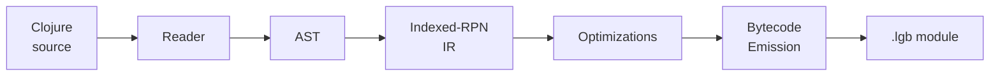

# Bytecode Compiler

The let-go compiler transforms source code into bytecode that runs on the [stack VM](stack-vm.md). The pipeline reads Clojure source, lowers it through an Indexed-RPN intermediate form, applies optimizations, and emits bytecode. Compiled bytecode is serialized to `.lgb` files, bundled into standalone binaries with `lg -b`, or compiled to WASM with `lg -w`.

## Compilation Pipeline

1. **Reader** (`pkg/compiler/reader.go`): Parses Clojure source into `vm.Value` AST nodes. Supports reader macros, `:lg` conditionals for let-go-only code, and syntax validation. Returns symbols, keywords, lists, vectors, and maps that drive compilation.

2. **Indexed-RPN IR** (`pkg/ir` via `.lg` source): Source is lowered to an SSA-equivalent intermediate form using indexed reverse Polish notation. Each operation's identity is its position on an implicit evaluation stack; values flow exactly once from producer to consumer, enabling efficient analysis without explicit variable renaming. This is the canonical form for optimization and code generation. See [Indexed-RPN IR](indexed-rpn-ir.md) for details.

3. **Optimizations**: The IR is analyzed and transformed:
   - Constant folding: evaluate pure operations with constant operands at compile time
   - Dead code elimination: remove operations with no consumers
   - Common subexpression elimination (CSE): hoist redundant computations
   - Dominance analysis and type inference: guide dispatch decisions
   - Inlining: expand small functions inline when profitable

4. **Bytecode Emission** (`pkg/bytecode`): IR is lowered to stack machine instructions. A `CodeChunk` groups bytecode, local variable slots, and a constant pool. Opcodes like `OP_LOAD_CONST`, `OP_INVOKE`, `OP_TAIL_CALL`, and `OP_RETURN` drive the [stack VM](stack-vm.md) interpreter. The emitter manages stack depth, closure capture, and frame reuse for tail calls.

5. **Serialization** (`pkg/bytecode/encoder.go`): Bytecode, constants, and metadata are encoded to binary format. Constants include scalars, persistent collections, symbols, and function closures; they are interned to a shared constant pool. The serialized form is a `.lgb` module file.

## Invocation Paths

**`lg -c app.lgb app.lg`**: Compile source to bytecode  
Reads the source file, runs the full pipeline, and writes a `.lgb` file. This bytecode can be run standalone without recompilation: `lg app.lgb`.

**`lg -b myapp app.lg`**: Bundle into a standalone binary  
Compiles to bytecode as above, then appends the bytecode (and resource files) to a copy of the `lg` executable using a trailer format. The binary is self-contained and runs anywhere. Trailer versions (legacy, v2 with resources, v3 with storage IDs) are in `pkg/bundle/bundle.go`.

**`lg -w site app.lg`**: Compile to a self-contained WASM web app  
Compiles to bytecode and bundles it into a `index.html` file. The WASM blob is inlined and gzipped (~6MB). A service worker handles COOP/COEP headers for SharedArrayBuffer. Programs using the `term` namespace get xterm.js terminal emulation. Run via `open site/index.html` in the browser.

**`lg app.lg`**: Direct evaluation  
Source is compiled in-memory and executed immediately in the VM. REPL compilation follows the same pipeline.

# Citations

[1] **pkg/compiler**: Reader, compilation context, and source evaluation  
https://github.com/nooga/let-go/tree/main/pkg/compiler

[2] **pkg/bytecode**: Encoder/decoder, module serialization, `.lgb` format  
https://github.com/nooga/let-go/tree/main/pkg/bytecode

[3] **pkg/bundle**: Standalone binary and WASM bundling  
https://github.com/nooga/let-go/tree/main/pkg/bundle

[4] **docs/guide/usage.md**: Compilation flags and build modes  
https://github.com/nooga/let-go/blob/main/docs/guide/usage.md

[5] **Indexed-RPN IR** (this wiki)  
[indexed-rpn-ir.md](indexed-rpn-ir.md)

[6] **Stack VM** (this wiki)  
[stack-vm.md](stack-vm.md)

---

See also: [let-go](../entities/let-go.md)
