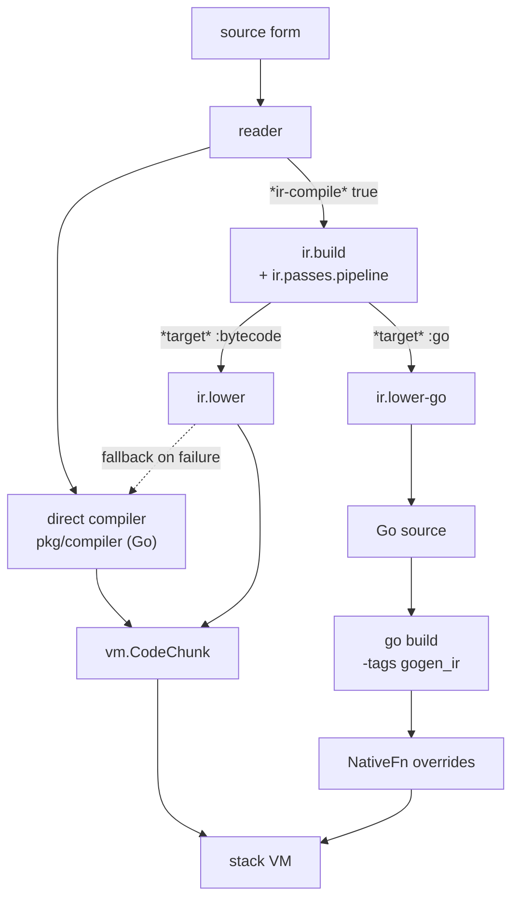

# Compile Paths

A form in let-go can become executable three ways. Only the first runs by default; the other two are opt-in, and the second falls back to the first when it cannot handle a function. Knowing which path a function took explains most performance and coverage questions, because the paths differ in what they can lower and in what they cost.



## Path 1: the direct compiler

`pkg/compiler` is a Go compiler from reader output straight to [stack VM](stack-vm.md) bytecode. It is what `lg script.lg`, `lg -e`, the REPL, and `lg -c` use for every form unless something routes a function elsewhere. It walks the form in post-order and emits stack operations as it goes, so it never has to reconstruct a stack layout; that property matters below. The [bytecode compiler](bytecode-compiler.md) page covers its stages and the [`.lgb` format](lgb-bytecode-format.md) covers what it writes.

## Path 2: the IR path at load time

The [IR pipeline](ir-pipeline.md) is written in let-go and sits behind one dynamic var. When `*ir-compile*` is true, the `defn` macro in `core.lg` hands the whole `(defn ...)` form to `ir.passes.pipeline/compile-form`, which builds IR, runs the optimization passes, and lowers through `ir.lower` to a `vm.CodeChunk`. The result is the same kind of chunk the direct compiler produces, so the VM does not know which path made it.

Four vars govern the path:

| Var | Default | Effect |
|---|---|---|
| `*ir-compile*` | `false` | Route `defn` bodies through the IR pipeline. `ir.passes.pipeline` must already be required; the macro throws otherwise. Set with `set!`, not an environment variable. |
| `*ir-compile-verbose*` | `false` | Print one line per fallback and append `[name error]` to `*ir-compile-fallback-log*`. |
| `*ir-compile-strict*` | `false` | Throw, naming the `defn`, instead of falling back. Added in #580 so a coverage loss can fail a test or a census. |
| `ir.passes.pipeline/*target*` | `:bytecode` | `:go` sends `compile-form` through `ir.lower-go` instead of `ir.lower` (path 3). |

The core comment above `*ir-compile*` still says only single-arity `defn`s take the IR path. The macro body hands multi-arity forms to `compile-form` as well and defines the returned multi-arity value directly, and a two-arity `defn` compiles under strict mode without falling back (checked 2026-09-05 at `0911118`). Treat the comment as historical.

### The hybrid fallback

If `compile-form` throws, or returns something that is not a chunk, the macro expands to the ordinary `(def name (fn ...))` and the direct compiler takes over. This is deliberate: without it a single unlowerable function would abort a whole file, and `*ir-compile*` would be an all-or-nothing switch that collapses on real code. The cost is that by default a fallback is silent. You pay the IR compile and run bytecode anyway, and nothing says so.

```
$ lg -e "(do (require 'ir.passes.pipeline) (set! *ir-compile* true) (set! *ir-compile-verbose* true)
         (eval '(defn g [x] (try (inc x) (catch e 0))))
         (deref *ir-compile-fallback-log*))"
ir-compile: defn g fell back to direct compile: ir/lower: unsupported op for lowering: :try
[[g "ir/lower: unsupported op for lowering: :try"]]
```

Under `*ir-compile-strict*` the same `defn` throws, so a test asserting that a form lowers can gate on it. The `ir-stress` harness binds strict mode for exactly that reason: with the default settings a downgrade to bytecode would score as a pass.

### What does not lower to bytecode

The first census of the bytecode path (#580, 2026-07-24) measured what `*ir-compile*` actually achieves, against the Go path that had been the only thing measured until then:

| backend | coverage | failures |
|---|---|---|
| `lower-go` (path 3) | 99.5% | 11 / 2432 |
| `lower` (path 2) | 70.7% | 713 / 2432 |

Two buckets held most of the 713: `:lower/not-on-stack/*` (535) and `:lower/unsupported-op/:try` (144). Both come from one cause. The IR is indexed RPN, so every operand is already an instruction index, but `ir.lower` discards the index and reconstructs a stack depth, and a value defined in another block or displaced by an earlier materialization has no computable depth. The stack VM gives lowering nowhere to spill: its addressing is `LOAD_ARG`, `LOAD_CLOSEDOVER`, and depth-relative `DUP_NTH`, with no writable frame slots. `try` has no emission case for the same reason, because a value cannot survive a handler boundary the stack cannot express. The direct compiler never meets the problem: a post-order walk maps onto a stack by construction. The same cause produces the extra `DUP_NTH` shuffle measured in #579 (`fib` at 23 instructions against the direct compiler's 18). Those numbers are from that date; re-run the census before quoting them as current.

### When path 2 pays

Pipeline load plus per-function compile is a one-time cost. The design doc's measurement on #555 found it pays back only on allocation-bound work: persistent maps, transducers, and `reduce` saw roughly 5 to 12 times fewer allocations, about 13% less wall-clock per run once heap churn dominates, breaking even around 64 runs on the persistent-map case. Compute-bound code such as `fib` or `loop`/`recur` is a small net loss with nothing to amortize against. Most of the win is the pipeline removing per-element boxing, not fusion. See [IR optimizations](ir-optimizations.md) for the passes involved.

## Path 3: Go lowering

With `*target*` bound to `:go`, `compile-form` runs `ir.lower-go`, which turns the optimized IR into Go source: block-parameter control flow becomes mutable locals with labels and gotos, typed arithmetic stays unboxed where [type inference](type-inference.md) proved it, and calls into other lowered functions can be direct Go calls. The Go toolchain then compiles that source. Two deployments use it:

- **The core itself.** `make generate` lowers `pkg/rt/core/**/*.lg` into `pkg/rt/core_go_lowered/`, a gitignored tree of Go files regenerated beside the committed `core_compiled.lgb` (`make check-lowered-fresh` flags a stale one). A build with `-tags gogen_ir` links that tree, and each lowered package's `init` registers its functions with `rt.RegisterGoOverrides`. When the runtime finishes loading a namespace from bytecode, `ApplyGoOverrides` replaces the vars the bytecode defined with the native implementations. Without the tag the registry stays empty and the hook is one map lookup.
- **Programs.** `scripts/lg-compile` (with `--entry-frame`) lowers a whole program and its dependencies to a Go package tree; `--target=go` is `cmd/lgbgen`'s flag and applies to the core only. [lg-compile](lg-compile.md) covers the driver, and `docs/design/go-aot-backend.md` the design.

`ir.lower-go` has two modes of its own: strict, where an unsupported op or shape throws, and bridge, where an unsupported function falls back at whole-function granularity. `*strict-structured?*` (seeded from `LG_STRICT_STRUCTURED`) makes structured-control-flow drift throw rather than emit a possibly mislowered `goto` body. Note that it only sees the Go backend; a bytecode-path lowering failure is invisible to it, which is why `*ir-compile-strict*` exists separately.

## Measuring coverage

Every knob above changes which forms convert, so a change to one is a coverage change until measured. `scripts/ir-stress.lg` drives a corpus through a chosen path and buckets each `defn` (`:ok`, `:lower/not-on-stack/<op>`, `:validate/no-term`, `:stress/timeout`, and so on), so a regression shows as a bucket that moved.

| Command | Measures |
|---|---|
| `make ir-stress` | native-lowering pass rate over the committed corpus |
| `make ir-stress-gate` | the same, ratcheted against `docs/perf/ir-stress-baseline.edn`; fails if failures grew |
| `make ir-stress-bytecode-gate` | the bytecode path (`LG_STRESS_BACKEND=lower`) against its own baseline |
| `make parity-full` | the Clojure test suite, ir-stress `lower-go`, ir-stress `ir-compile`, and the deftype fixtures, each run untagged and under `-tags gogen_ir`; fails if pass/fail counts or failure-bucket distributions differ between the two builds |

`LG_STRESS_BACKEND` selects `lower-go` (default), `lower`, or `ir-compile`; the last evals each `defn` under `*ir-compile*` with strict mode bound, which is what users hit at load time. A `trace` mode drills into one `defn` with per-pass timings.

## Citations

**Resource:** [pkg/rt/core/core.lg](https://github.com/nooga/let-go/blob/main/pkg/rt/core/core.lg): `*ir-compile*`, `*ir-compile-verbose*`, `*ir-compile-fallback-log*`, `*ir-compile-strict*`, and the `defn` macro's hybrid fallback  
**Related:**
- [docs/design/ir-dynamic-vars.md](https://github.com/nooga/let-go/blob/main/docs/design/ir-dynamic-vars.md): every dynamic var the pipeline reads, with defaults and the amortization measurement
- [scripts/ir-stress.md](https://github.com/nooga/let-go/blob/main/scripts/ir-stress.md): harness modes, environment variables, bucket meanings
- [pkg/rt/core/ir/lower.lg](https://github.com/nooga/let-go/blob/main/pkg/rt/core/ir/lower.lg): IR to bytecode, with the stack-slot strategy in its header
- [pkg/rt/core/ir/lower_go.lg](https://github.com/nooga/let-go/blob/main/pkg/rt/core/ir/lower_go.lg): IR to Go, strict and bridge modes
- [pkg/rt/gogen_override.go](https://github.com/nooga/let-go/blob/main/pkg/rt/gogen_override.go): `RegisterGoOverrides` and `ApplyGoOverrides`, including the init-order hazard they guard
- [pkg/compiler](https://github.com/nooga/let-go/tree/main/pkg/compiler): the direct compiler
- PRs: [#580](https://github.com/nooga/let-go/pull/580) strict mode and the first bytecode-path census, [#579](https://github.com/nooga/let-go/pull/579) lowering-shape ratchet, [#555](https://github.com/nooga/let-go/pull/555) dynamic vars reference

See also: [IR Pipeline](ir-pipeline.md), [IR Passes](ir-passes.md), [Indexed-RPN IR](indexed-rpn-ir.md), [Stack VM](stack-vm.md), [let-go](../entities/let-go.md)
